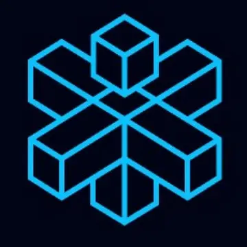
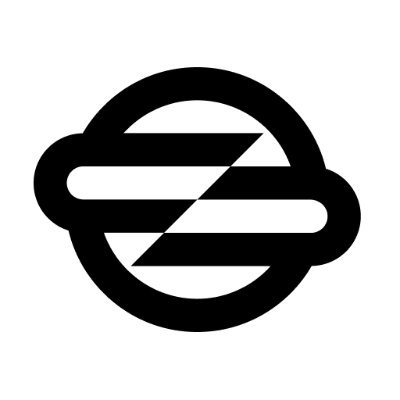

## Hi there🤠
My name is Orange Bobby and I'm blockchain validator.
### My Journey
With 2 years of experience in the blockchain industry, I specialize in network validation, smart contract auditing, and cryptographic security. My commitment to maintaining robust and secure blockchain networks has allowed me to contribute significantly to the ecosystem. I take pride in my role, knowing that the work I do helps uphold the principles of decentralization and transparency.
### Get in Touch
I am always eager to connect with fellow enthusiasts, developers, and innovators. Let's work together to build a decentralized future!
## Links🔗

## 🔥My Validators🔥
#### [Haqq](https://testnet.ping.pub/haqq/staking/haqqvaloper1cfu64mv4kutgxp26jg5xpwdup6xx0ymzf4pd30)

#### [Nillion](https://testnet.nillion.explorers.guru/validator/nillionvaloper1nh6ah6v5fdkfzz9k88kn30ky4l9r4qhz9my5el)
#### [Babylon](https://github.com/babylonchain/networks/pull/301)
#### [CrossFi](https://test.xfiscan.com/validators/mxvaloper14jw0a2s27pq8rcmqwv55d349zp0uaydsta8sgj)
#### [0G](https://testnet.0g.explorers.guru/validator/0gvaloper1u72ku05dvatllml2yt0a7hzt89dq8uvcahlyla)
#### [ITRocket](https://testnet.itrocket.net/crossfi/staking/mxvaloper14jw0a2s27pq8rcmqwv55d349zp0uaydsta8sgj)
#### [Socotra](https://socotra.mcnscan.io/chain/L6HoCoW3WjunTJLj17fMnGpBbLtcZXdqbw2TsvfYDJzbsqVEi/)
#### [Genesis](https://genesis.mcnscan.io/chain/2Zr6aSGX8LAatKXLcytd1jwssjwUfKXr86WyGTrfxpXHDV8Cgm/)
